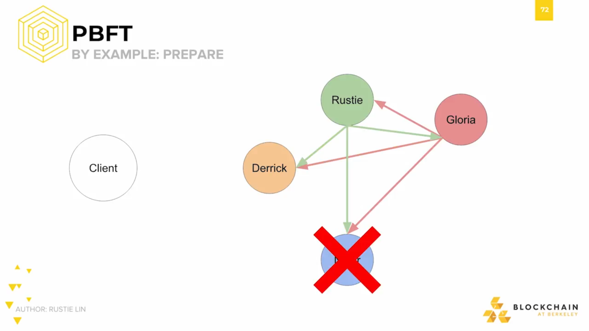

The PBFT algorithm handles less than 1/3 Byzantine faults, as we saw in the section with the Byzantine generals problem. More traditionally, this has been written as: **the system can handle f Byzantine faults, where there are 3f + 1 total nodes**. It's also really fast.  

The main PBFT algorithm consists of three phases: 
- pre-prepare
- prepare 
- commit 
PBFT begins when the client submits a request to the primary node. The primary node is responsible for advocating for the client request,and this should be familiar since it's a common design pattern. For example, remembering back to Paxos, the Proposer proposes new decrees to other legislators in the Paxon Parliament based on the requests of the people. 

In this case. the primary node is Derrick. We have a total of 4 nodes, meaning that we should be able to withstand 1 fault, since 1/4 is less than 1/3.   

So let's say one of our 4 nodes, Nadir, drops out due to a spotty internet connection. Nadir might've dropped out, but the other 3 nodes might not know that yet, so they'll still send messages to him.

The next step is **pre-prepare**, which is one of the three main phases - pre-prepare, prepare, and commit. In the pre-prepare phase, the primary node Derrick sends out pre-prepare messages to everyone in the network. A node accepts the pre-prepare message so long as its valid. We won't go too much in detail, but messages contain a sequence number - like the increasing numbers Proposers in Paxos assign to each of their decrees. They also contain signatures, and other useful metadata that lets nodes determine message validity.

If a node accepts a pre-prepare message, it follows up by sending out a prepare message to everyone else. And prepare messages are accepted by receiving nodes so long as they're valid, again, based on sequence number, signature, and other metadata. A node is considered "prepared" if it has seen the original request from the primary node, has pre-prepared, and has seen 2f prepare messages that match its pre-prepare - making for 2f + 1 prepares. Again, **f is the number of Byzantine faults**.

After nodes have prepared, they send out a commit message. If a node receives f + 1 valid commit messages, then they carry out the client request and then finally send out the reply to the client. 

The client waits for f + 1  of the same reply. Since we allow for at most f faults, we need to wait for at least f + 1, and this ensures the response to be valid. After this point, the client gets the correct response.

Here's a diagram from the PBFT whitepaper, which models exactly the scenario we just went over. The diagram has five processes, or nodes in our case. The client is process C. Derrick is process 0, Rustie is process 1, Gloria is process 2, and Nadir is process 3.

In the first step, the client sent a message to Derrick, process 0. That's the initial request. During this time, Nadir fails.

Then, Derrick sends a pre-prepare message to the rest of us processes.

Everyone except Nadir responds with a prepare message.

After acknowledging everyone's presence, we all send the commit message.

After hearing sufficient amount of commits, we respond directly to the client.

