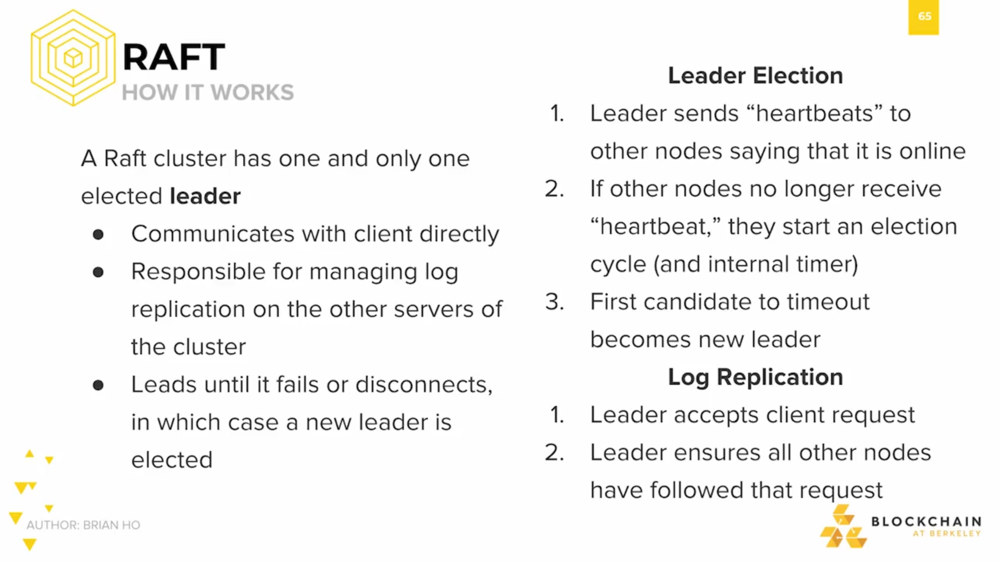

Paxos is a Greek island.

The Paxos parliament used the Paxos algorithm to pass decrees and make sure everyone on the island was in consensus of the latest law. And the reason it was the "part-time" parliament was that legislators in the Paxon parliament were known to leave sporadically - to attend banquets and other outside activities. No one was willing to remain in the chambers all the time, and they didn't have secretaries either, so instead, each Paxon legislator maintained a ledger, where they'd record everything that happened.

So diving a bit more in depth, the paper specifies that within the Paxon parliament, there are three types of legislators: **proposers**, **acceptors**, and **learners**.
- **Proposers** champion the requests of citizens, and bring up new bills to others in Paxon parliament. 
- **Acceptors** are legislators that vote.
- And after consensus is reached, **Learners** learn the result of the consensus and carry out the bill.

In order for consensus to be reached, a majority of acceptors must vote for a new bill. We call any majority of acceptors a quorum. A key observation to make here is that any two quorums must overlap. We'll see later on that the idea of quorums is also very important in other consensus algorithm, such as those that are considered federated consensus algorithms.

The protocol that the Paxon parliament uses proceeds over several rounds, until consensus is reached. 

Each successful round has two phases: **prepare** and **accept**. First, some citizens will talk to a proposer. And then after that, the proposer proposes a decree to the Paxon parliament. A decree has a **number** and a **value**, the **value** can be anything, such as "The sales of brown goats is permitted", or "Painting on temple wall is forbidden". However, there's a requirement that the **number** associated with the decree must be strictly increasing. 

After a decree is proposed, within the parliament, the acceptors discuss. If at any point in time, a quorum, or majority of legislators are in the chambers, and all vote yes, then the decree would be passed, and they'd all write it down on everyone's ledgers.

After reaching consensus, the learners learn the result, and then let the entire island know what happened in parliament.

So there's a very clear parallel between the Paxon parliament and distributed consensus.

There's an obvious correspondence between this database system and the Paxon parliament.

Individual notes within a distributed system are like the legislators, since they're the ones whose job it is to serve the citizens - the client programs - and come to consensus, and then broadcast or take action on the result.

And the state of the distributed database is like the current law passed by the parliament.

One major assumption that Paxos makes is that node aren't trying to subvert the protocol, and that messages are delivered without corruption. In other words, Paxos only works for the fail-stop scenario, and does not account for Byzantine faults.

In the paper, Lamport describes that the people of Paxos are fairly agreeable and that there's an atmosphere of mutual trust on the island. So long as they're in the chambers, all legislators would agree with one another. The result of this is that Paxos is very fast, and in practice is used to replicate large sets of data.

At Google, Paxos is used in their Chubby distributed lock service, where it's very important for everyone to agree to only allow one process to have write access to a certain piece of data at a given time. And just to name a few more, Google Spanner, Microsoft Bing Autopilot, Heroku, WeChat, and WANDisco all use Paxos internally.

## Raft

The original Paxos whitepaper was known to be pretty difficult to understand, and despite the original author's efforts to clarify further, with a follow up paper titled "Paxos Made Simple", it still caused mass confusion - maybe because of the huge Paxon parliament story.

In 2014, an alternative to Paxos was proposed. The paper was titled "In Search of an Understandable Consensus Algorithm", poking fun at the confusion Paxos caused, and even the name of the algorithm - Raft - is meant to be a joke. You'd use a raft to escape the island of Paxos. So the general consensus nowadays is that Raft is a bit more understandable than Paxos, and easier to implement.

Its design is leader-based, meaning that on each round a leader would be chosen to propose new updates, and JP Morgan's Quorum, which was designed to be an enterprise version of Ethereum, swaps out the public Proof-of-Work algorithm that Ethereum uses for a faster Raft-based consensus.

There's a really good Raft simulation that I'll link in the "Readings" section for this week, but here's a brief rundown of how Raft consensus works.

Each instance of Raft has one elected leader, who communicates with the client directly. The leader's responsible for orchestrating the sending of messages to other nodes within the cluster and for maintaining log replication or everything that happens. 

The leader accepts a client request, and then oversees all other nodes to make sure that they too have followed the request; and then the log of that request is replicated. The leader leads the whole consensus until it fails or stops, in which case a new leader is elected.

And the consensus algorithm proceeds in partial synchrony. The leader is tasked with sending out "heartbeat" messages to other nodes, telling everyone else that it's online. And these heartbeats are sent out at regular intervals - like an actual heartbeat. If no other nodes hear a heartbeat, then they can assume that the leader is dead - failed, stopped, or crashed - and then they too start an election cycle. This involves all nodes beginning an internal timer, starting whenever they realize that they're no longer receiving heartbeats, and the first node to timeout gets to become the new leader.

And just as a reminder, please check out this awesome raft simulation that we'll link in the readings section. It teaches everything we just went over in the previous slide but by example. All credit and respect to the original author!

http://thesecretlivesofdata.com/raft/