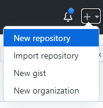
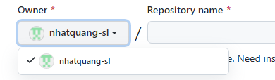
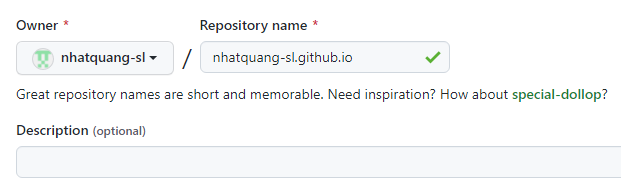
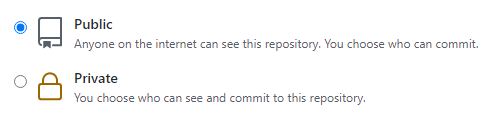
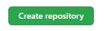

## About GitHub Pages
GitHub Pages is a static site hosting service that takes HTML, CSS, and JavaScript files straight from a repository on GitHub, optionally runs the files through a build process, and publishes a website.

You can host your site on GitHub's `github.io` domain or your own custom domain. For more information, see [Using a custom domain with GitHub Pages](https://docs.github.com/en/pages/configuring-a-custom-domain-for-your-github-pages-site)

## Creating a repository for your site
1. In the upper-right corner of any page, use the <svg xmlns="http://www.w3.org/2000/svg" xmlns:xlink="http://www.w3.org/1999/xlink" aria-hidden="true" role="img" style="vertical-align: -0.125em;" width="1em" height="1em" preserveAspectRatio="xMidYMid meet" viewBox="0 0 16 16"><path fill-rule="evenodd" d="M7.75 2a.75.75 0 0 1 .75.75V7h4.25a.75.75 0 1 1 0 1.5H8.5v4.25a.75.75 0 1 1-1.5 0V8.5H2.75a.75.75 0 0 1 0-1.5H7V2.75A.75.75 0 0 1 7.75 2z" fill="currentColor"/></svg> menu, and select **New repository**.  

2. Use the Owner drop-down menu, and select the account you want to own the repository.  

3. Type a name for your repository and an optional description. If you're creating a user or organization site, your repository must be named `<user>.github.io` or `<organization>.github.io`. If your user or organization name contains uppercase letters, you must lowercase the letters.

4. Choose a repository visibility.  

5. Click **Create repository**.  

## Reference
- [About GitHub Pages](https://docs.github.com/en/pages/getting-started-with-github-pages/about-github-pages)