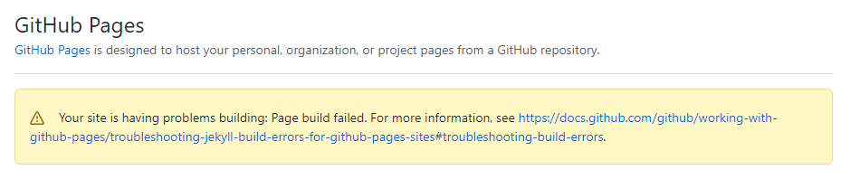

Permalinks are the output path for your pages, posts, or collections. They allow you to structure the directories of your source code different from the directories in your output.

## Front Matter
The simplest way to set a permalink is using front matter. You set the `permalink` variable in front matter to the output path you’d like.

For example, you might have a page on your site located at `/my_pages/about-me.html` and you want the output url to be `/about/`. In front matter of the page you would set:

```yml
---
permalink: /about/
---
```

## Global
Setting a permalink in front matter for every page on your site is no fun. Luckily, Jekyll lets you set the permalink structure globally in your `_config.yml`.

To set a global `permalink`, you use the permalink variable in `_config.yml`. You can use placeholders to your desired output. For example:
```
permalink: /:slugified_categories/:title
```

## Placeholders
Here's the full list of placeholders available: [Placeholders](https://jekyllrb.com/docs/permalinks/#placeholders)

There is one placeholder that I prefer to use is `slugified_categories`.

>The specified categories for this post but slugified. If a category is a composite of multiple words, Jekyll will downcase all alphabets and replace any non-alphanumeric character with a hyphen. (e.g. ``"Work 2 Progress"`` will be converted into ``"work-2-progress"``)
>
>If a post has multiple categories, Jekyll will create a hierarchy (e.g. ``/work-2-progress/category2``). Also Jekyll automatically parses out double slashes in the URLs, so if no categories are present, it will ignore this.

## Problem


The `slugified_categories` is only supported by Jekyll version `4.1`, but the GitHub Pages support Jekyll version `3.9.0`.

We can solve this problem by using [GitHub Actions]()

## Reference
- [Permalinks](https://jekyllrb.com/docs/permalinks/)