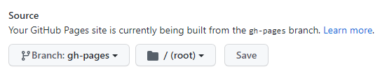

When building a Jekyll site with GitHub Pages, the standard flow is restricted for security reasons and to make it simpler to get a site setup. For more control over the build and still host the site with GitHub Pages you can use GitHub Actions.

Jekyll version — Instead of using the currently enabled version at `3.9.0`, you can use any version of Jekyll you want. For example `4.2.1`, or point directly to the repository.

## Setting up the ActionPermalink
GitHub Actions are registered for a repository by using a YAML file inside the directory path `.github/workflows`.

Create a **workflow file**, say `github-pages.yml`, using either the GitHub interface or by pushing a YAML file to the workflow directory path manually. The base contents are:

```yml
name: Build and deploy Jekyll site to GitHub Pages
on:
  push:
    branches:
      - master
jobs:
  github-pages:
    runs-on: ubuntu-latest
    steps:
    - uses: actions/checkout@v2

    # Use GitHub Actions' cache to shorten build times and decrease load on servers
    - uses: actions/cache@v2
      with:
        path: vendor/bundle
        key: ${{ runner.os }}-gems-${{ hashFiles('**/Gemfile') }}
        restore-keys: |
          ${{ runner.os }}-gems-

    # Specify the Jekyll source location as a parameter
    # Specify the target branch (optional)
    - uses: helaili/jekyll-action@v2
      with:
        token: ${{ secrets.GITHUB_TOKEN }}
        jekyll_src: 'docs'
        target_branch: 'gh-pages'
```
The above workflow can be explained as the following:
- We trigger the build using **on.push** condition for `master` branch only - this prevents the Action from overwriting the `gh-pages` branch on any feature branch pushes.
- The **name** of the job matches our YAML filename: `github-pages`.
- The **checkout** action takes care of cloning your repository.
- We specify our selected **action** and **version number** using `helaili/jekyll-action@2.0.5`. This handles the build and deploy.
    - **jekyll_src**: The Jekyll website source directory.
    - **target_branch**: The target branch name the sources get pushed to.

## Build and Deploy
On pushing any local changes onto `master`, the action will be triggered and the build will start.

To watch the progress and see any build errors, check on the build status using one of the following approaches:
- **View by commit**: Go to the repository level view in GitHub. Under the most recent commit (near the top) you'll see a **status symbol** next to the commit message as a tick or X. Hover over it and click the **details** link.
- **Actions tab**: Go to the repository's Action tab. Click on the `jekyll` workflow tab.

## Update GitHub Pages
**Update Source folder to point to the root folder**  


## Reference
- [GitHub Actions](https://jekyllrb.com/docs/continuous-integration/github-actions/)
- [Jekyll Actions](https://github.com/marketplace/actions/jekyll-actions)