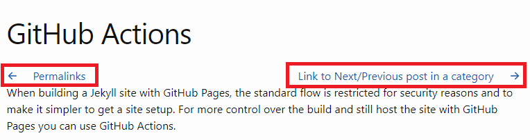

When in a post, we usually need to go next/back to another post. So it would be great if our post has links to next/previous post.

## Get the Next/Previous post link
Use the following code to get the next/previous post link then assign to `next_post`/`prev_post`.
```liquid

    
    
        
            
            
        
    
    
        
            
        
        
            
        
    

```

## Display the Next/Previous post link
Use the following code to display the next/previous post.
```liquid

    
        <div class="article-previous">
            <a href="{{ prev_post.url }}">
                <span class="iconify-inline" data-icon="akar-icons:arrow-left"></span>
                &nbsp;&nbsp;&nbsp;&nbsp;{{ prev_post.title }}</a>
        </div>
    
    
        <div class="article-next">
            <a href="{{ next_post.url }}">
                {{ next_post.title }}&nbsp;&nbsp;&nbsp;&nbsp;
                <span class="iconify-inline" data-icon="akar-icons:arrow-right"></span>
            </a>
        </div>
    

```

## Add links to Post layout
Now I want to add the next/previous post link to the Post layout so that these links will display as default for all posts. So that we will override the Post layout.

1. Create a `_layouts` folder under `docs` folder.

1. Get the theme path, run `bundle info --path` followed by the name of the theme’s gem, e.g., `bundle info --path minima` for Jekyll’s default theme.

2. Browse to the theme path, you will see the following structure folders.
```
.
├── LICENSE.txt
├── README.md
├── _includes
│   ├── disqus_comments.html
│   ├── footer.html
│   ├── google-analytics.html
│   ├── head.html
│   ├── header.html
│   ├── icon-github.html
│   ├── icon-github.svg
│   ├── icon-twitter.html
│   └── icon-twitter.svg
├── _layouts
│   ├── default.html
│   ├── home.html
│   ├── page.html
│   └── post.html
├── _sass
│   ├── minima
│   │   ├── _base.scss
│   │   ├── _layout.scss
│   │   └── _syntax-highlighting.scss
│   └── minima.scss
└── assets
    └── main.scss
```
4. Copy the `post.html` to our `_layouts` folder.

5. Update the `post.html` file to display next/previous post link as the following:

```liquid
---
layout: default
---



    
        
        
    


    
        
    
    
        
    



<article class="post h-entry" itemscope itemtype="http://schema.org/BlogPosting">
    <header class="post-header">
        <h1 class="post-title p-name" itemprop="name headline">{{ page.title | escape }}</h1>
    </header>

    
    
        <div class="article-previous">
            <a href="{{ prev_post.url }}">
                <span class="iconify-inline" data-icon="akar-icons:arrow-left"></span>
                &nbsp;&nbsp;&nbsp;&nbsp;{{ prev_post.title }}</a>
        </div>
    
    
        <div class="article-next">
            <a href="{{ next_post.url }}">
                {{ next_post.title }}&nbsp;&nbsp;&nbsp;&nbsp;
                <span class="iconify-inline" data-icon="akar-icons:arrow-right"></span>
            </a>
        </div>
    
    
    <div class="post-content e-content" itemprop="articleBody">{{ content }}</div>

    
    
        
    
    
    <a class="u-url" href="{{ page.url | relative_url }}"></a>
</article>



    <div class="article-previous">
        <a href="{{ prev_post.url }}">
            <span class="iconify-inline" data-icon="akar-icons:arrow-left"></span>
            &nbsp;&nbsp;&nbsp;&nbsp;{{ prev_post.title }}</a>
    </div>


    <div class="article-next">
        <a href="{{ next_post.url }}">
            {{ next_post.title }}&nbsp;&nbsp;&nbsp;&nbsp;
            <span class="iconify-inline" data-icon="akar-icons:arrow-right"></span>
        </a>
    </div>


```

## Add style for next/previous post link
1. Create a `_sass` folder under `docs` folder.

2. Create a `_pager.scss` file under `_sass` folder with the following code:
```css
.article-previous,
.article-next {
  display: inline;
  a {
    text-decoration: none;
  }
}

.article-next {
  float: right;
}

```
3. Create `css` folder under `assets` folder.

4. Create `styles.scss` file under `css` folder with the following code:
```css
---
---

@import "pager";
```

5. Add the following code at the end of `_config.yml` file:
```YAML
sass:
  sass_dir: _sass
```

6. Add the following code to `default.html` file:
```HTML
<link rel="stylesheet" type="text/css" href="{{site.baseurl}}/assets/css/styles.css"/>
```

7. Finally we will get the result.  


## Reference
- [Overriding theme defaults](https://jekyllrb.com/docs/themes/#overriding-theme-defaults)